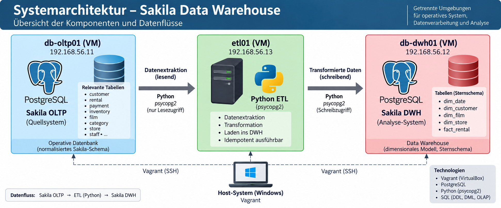

# Sakila Data Warehouse

Dieses Projekt implementiert ein Data Warehouse auf Basis der PostgreSQL-Version der Sakila-Beispieldatenbank.

Die operative Sakila-Datenbank dient als OLTP-Quellsystem. Ein in Python implementierter ETL-Prozess extrahiert und transformiert die relevanten Daten und lädt sie in ein separates PostgreSQL Data Warehouse mit Sternschema.

Die gesamte Umgebung wird mit Vagrant und VirtualBox reproduzierbar bereitgestellt.



## Architektur

Das Projekt besteht aus drei virtuellen Maschinen:

| Maschine | Hostname | IP-Adresse | Aufgabe |
|---|---|---|---|
| `oltp` | `db-oltp01` | `192.168.56.11` | PostgreSQL mit Sakila-Quelldatenbank |
| `etl` | `etl01` | `192.168.56.13` | Python-ETL-Prozess |
| `dwh` | `db-dwh01` | `192.168.56.12` | PostgreSQL Data Warehouse |

Der Datenfluss erfolgt folgendermassen:

`Sakila OLTP` → `Python ETL` → `Sakila Data Warehouse` → `OLAP-Analysen`

## Technologien

- PostgreSQL
- Python
- psycopg2
- SQL
- Vagrant
- VirtualBox
- Debian
- Git

## Data Warehouse

Das Data Warehouse verwendet ein Sternschema mit der Faktentabelle `fact_rental` und vier Dimensionstabellen:

- `dim_date`
- `dim_customer`
- `dim_film`
- `dim_store`

Eine Zeile in `fact_rental` repräsentiert eine Vermietung eines Films an einen Kunden.

Das Data Warehouse enthält nach erfolgreicher Ausführung des ETL-Prozesses `16'044` Vermietungen.

## Projektstruktur

```text
sakila-data-warehouse/
├── Vagrantfile
├── README.md
├── provisioning/
│   ├── oltp.sh
│   ├── dwh.sh
│   └── etl.sh
├── etl/
│   └── load_dwh.py
├── sql/
│   ├── oltp/
│   │   ├── postgres-sakila-schema.sql
│   │   └── postgres-sakila-insert-data.sql
│   ├── dwh/
│   │   └── 01_star_schema.sql
│   └── olap/
│       ├── 01_analysen.sql
│       └── 02_quality_checks.sql
└── docs/
    ├── dokumentation.md
    └── images/
```

## Installation

Vorausgesetzt werden Git, Vagrant und VirtualBox.

Repository klonen:

```bash
git clone https://github.com/t-rasiah/sakila-data-warehouse.git
cd sakila-data-warehouse
```

Virtuelle Maschinen erstellen:

```bash
vagrant up
```

Status überprüfen:

```bash
vagrant status
```

Nach erfolgreicher Provisionierung sollten die Maschinen `oltp`, `etl` und `dwh` den Zustand `running` aufweisen.

## ETL-Prozess

Mit der ETL-Maschine verbinden:

```bash
vagrant ssh etl
```

ETL-Prozess ausführen:

```bash
cd /vagrant
/opt/sakila-etl/venv/bin/python etl/load_dwh.py
```

Nach erfolgreicher Ausführung enthält die Faktentabelle `fact_rental` `16'044` Vermietungen.

## OLAP und Qualitätsprüfungen

Die implementierten OLAP-Abfragen befinden sich unter:

```text
sql/olap/01_analysen.sql
```

Die Datenqualitätsprüfungen befinden sich unter:

```text
sql/olap/02_quality_checks.sql
```

Zu den implementierten Analysen gehören unter anderem zeitliche Auswertungen, Filmkategorien, Filialvergleiche, geografische Analysen sowie `ROLLUP` und `CUBE`.

## Dokumentation

Die vollständige Projektdokumentation mit Datenmodell, ETL-Prozess, OLAP-Analysen, Testergebnissen und Reproduzierbarkeit befindet sich unter:

[Projektdokumentation](docs/dokumentation.md)

## Datenquelle

Als Quelldatensatz wird die PostgreSQL-Version der Sakila-Beispieldatenbank aus dem öffentlichen jOOQ-Sakila-Projekt verwendet:

https://github.com/jOOQ/sakila

Lizenz der Quelldaten: BSD 2-Clause License.