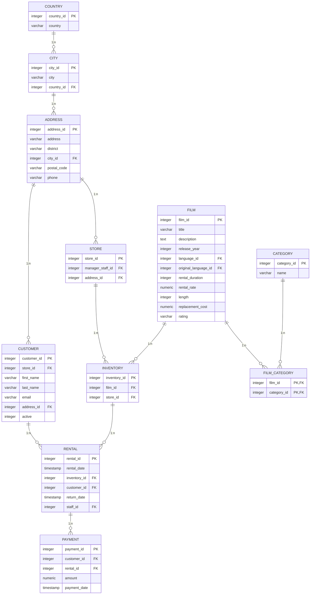
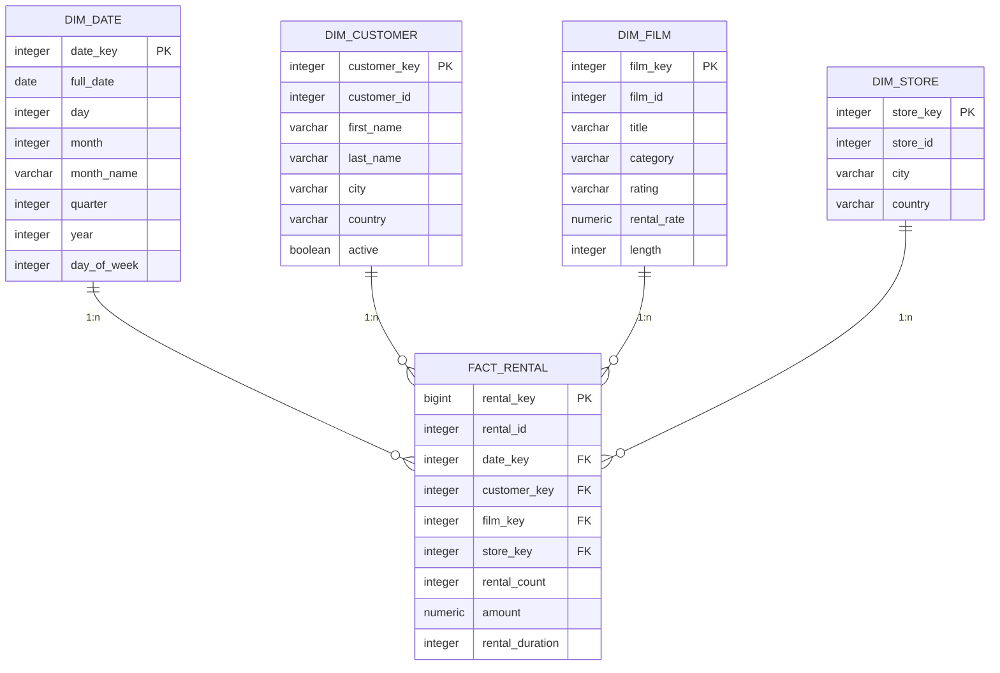
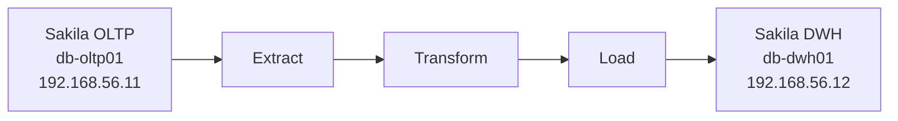
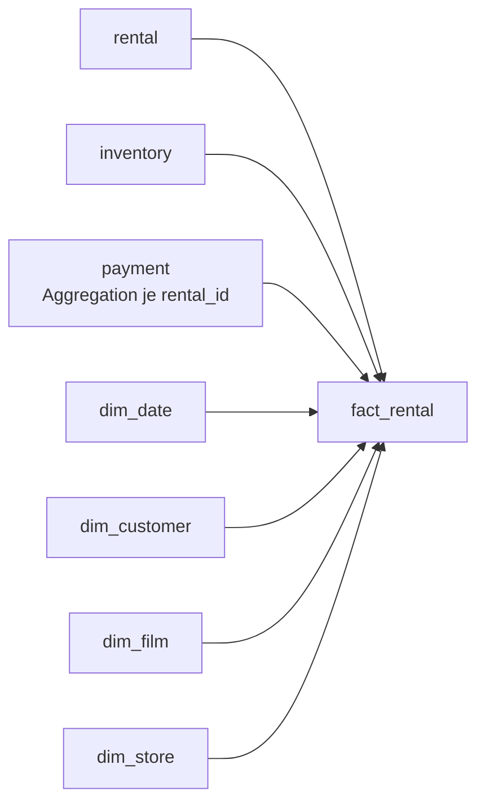
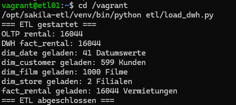
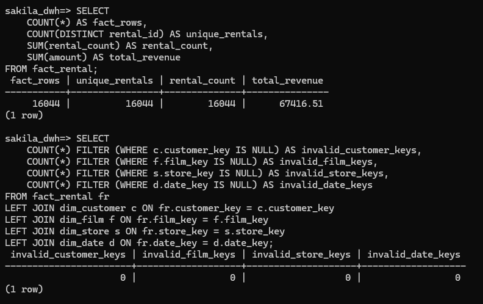

# Sakila Data Warehouse

## 1. Einleitung

### 1.1 Ausgangslage

Im Rahmen dieser Arbeit wurde auf Basis der Sakila-Beispieldatenbank ein reproduzierbares Data Warehouse aufgebaut. Die operative PostgreSQL-Datenbank dient als OLTP-Quellsystem. Relevante Daten werden über einen separaten Python-ETL-Prozess extrahiert, transformiert und in ein analytisch optimiertes PostgreSQL Data Warehouse geladen.

Das Projekt bildet damit eine vollständige Verarbeitungskette ab:

`OLTP-Datenbank` → `ETL` → `Data Warehouse` → `OLAP-Analyse`

Der Schwerpunkt liegt auf Datenbankdesign, dimensionaler Modellierung, ETL-Verarbeitung, analytischen SQL-Abfragen, Datenqualität und reproduzierbarer Infrastruktur.

### 1.2 Zielsetzung

Ziel war die Umsetzung eines Systems, das folgende Anforderungen erfüllt:

- getrennte Systeme für OLTP, ETL und Data Warehouse
- PostgreSQL als Datenbanksystem
- normalisierte Sakila-Datenbank als operative Datenquelle
- dimensionales Datenmodell als Sternschema
- Python-basierter ETL-Prozess
- analytische SQL-Abfragen mit Aggregationen, `ROLLUP` und `CUBE`
- technische Validierung der geladenen Daten
- wiederholbare ETL-Ausführung ohne doppelte Faktendatensätze
- reproduzierbarer Aufbau mit Vagrant

Die Arbeit kombiniert damit relationale Datenbanken, SQL, Data Warehousing, ETL, OLAP, Linux und Virtualisierung in einer zusammenhängenden praktischen Umsetzung.

---

## 2. Architektur und technische Umsetzung

### 2.1 Systemarchitektur

Die Projektumgebung besteht aus drei virtuellen Maschinen:

| System | Hostname | IP-Adresse | Aufgabe |
|---|---|---|---|
| OLTP | `db-oltp01` | `192.168.56.11` | PostgreSQL mit Sakila-Quelldatenbank |
| ETL | `etl01` | `192.168.56.13` | Python-basierte ETL-Verarbeitung |
| DWH | `db-dwh01` | `192.168.56.12` | PostgreSQL Data Warehouse |


*Abbildung 1: Systemarchitektur und Datenfluss zwischen OLTP-System, ETL-Server und Data Warehouse.*

Die Systeme wurden bewusst getrennt aufgebaut. Dadurch werden operative Datenhaltung, Datenverarbeitung und analytische Datenhaltung voneinander isoliert.

Der ETL-Prozess verbindet sich über `psycopg2` mit beiden PostgreSQL-Systemen. Das OLTP-System wird dabei nur lesend verwendet. Schreibzugriffe erfolgen auf das Data Warehouse.

### 2.2 Technologien

| Technologie | Verwendung |
|---|---|
| PostgreSQL | OLTP- und DWH-Datenbank |
| Python | ETL-Implementierung |
| psycopg2 | PostgreSQL-Zugriff aus Python |
| SQL | Datenmodell, OLAP und Qualitätsprüfungen |
| Vagrant | reproduzierbare VM-Bereitstellung |
| VirtualBox | Virtualisierung |
| Debian | Betriebssystem der virtuellen Maschinen |
| Git | Versionsverwaltung |

### 2.3 Reproduzierbarkeit

Die virtuellen Maschinen selbst werden nicht im Repository gespeichert. Versioniert werden stattdessen:

- `Vagrantfile`
- Provisionierungsskripte
- SQL-Skripte
- ETL-Quellcode
- Dokumentation

Dadurch kann die Umgebung aus dem Repository neu aufgebaut werden.

---

## 3. OLTP-Quelldatenbank

### 3.1 Sakila als operatives Datenmodell

Als Quellsystem wird die PostgreSQL-Version der Sakila-Beispieldatenbank verwendet. Sie bildet den Betrieb eines DVD-Verleihs mit Kunden, Filmen, Inventar, Vermietungen, Zahlungen und Filialen ab.

Für das Data Warehouse sind insbesondere folgende Tabellen relevant:

| Tabelle | Verwendung |
|---|---|
| `customer` | Kunden |
| `address`, `city`, `country` | geografische Kundendaten |
| `film` | Filminformationen |
| `film_category`, `category` | Filmkategorien |
| `inventory` | Zuordnung Film und Filiale |
| `rental` | Vermietungsvorgänge |
| `payment` | Zahlungen |
| `store` | Filialen |

### 3.2 Relevante Beziehungen

Das folgende Diagramm zeigt den für die ETL-Verarbeitung relevanten Ausschnitt des relationalen Quellmodells.



*Abbildung 2: Vereinfachtes ER-Diagramm der für das Data Warehouse relevanten Tabellen der Sakila-Quelldatenbank.*

### 3.3 Datenbestand

Vor der ETL-Verarbeitung wurde der Datenbestand des Quellsystems kontrolliert.

| Tabelle | Datensätze |
|---|---:|
| `actor` | 200 |
| `film` | 1'000 |
| `customer` | 599 |
| `rental` | 16'044 |
| `payment` | 16'049 |


Die Anzahl der Zahlungen ist höher als die Anzahl der Vermietungen. Deshalb werden Zahlungen während der Transformation pro `rental_id` aggregiert. Die Granularität der späteren Faktentabelle bleibt dadurch eine Zeile pro Vermietung.

---

## 4. Data-Warehouse-Design

### 4.1 Wahl des Datenmodells

Für das Data Warehouse wurde ein Sternschema gewählt. Im Zentrum steht `fact_rental`. Die Dimensionen enthalten die für Analysen benötigten Kontextinformationen.

Das relationale Quellmodell wird dabei bewusst nicht unverändert übernommen. Für analytische Abfragen werden Informationen zusammengeführt und teilweise denormalisiert.

### 4.2 Granularität

Die Granularität der Faktentabelle wurde wie folgt definiert:

> Eine Zeile in `fact_rental` repräsentiert eine Vermietung eines Films an einen Kunden in einer Filiale.

Diese Definition ist zentral für die Konsistenz der Kennzahlen. `rental_id` wird zusätzlich als eindeutige Quell-ID gespeichert.

### 4.3 Sternschema



*Abbildung 3: Sternschema des implementierten Sakila Data Warehouses.*

### 4.4 Faktentabelle

`fact_rental` enthält die Fremdschlüssel auf die vier Dimensionen sowie die analysierbaren Kennzahlen.

| Attribut | Bedeutung |
|---|---|
| `rental_key` | Surrogate Key der Faktentabelle |
| `rental_id` | eindeutige ID der Quellvermietung |
| `date_key` | Verweis auf `dim_date` |
| `customer_key` | Verweis auf `dim_customer` |
| `film_key` | Verweis auf `dim_film` |
| `store_key` | Verweis auf `dim_store` |
| `rental_count` | Anzahl Vermietungen, pro Faktzeile `1` |
| `amount` | aggregierter Umsatz der Vermietung |
| `rental_duration` | tatsächliche Mietdauer in Tagen |

### 4.5 Dimensionen

`dim_date` ermöglicht zeitliche Analysen nach Tag, Monat, Quartal und Jahr.

`dim_customer` kombiniert Kunden- und Standortinformationen. Dadurch sind beispielsweise Analysen nach Land möglich, ohne zur Laufzeit mehrere OLTP-Tabellen verbinden zu müssen.

`dim_film` enthält Filminformationen inklusive Kategorie. Die Kategorie wird bewusst denormalisiert, um typische OLAP-Abfragen zu vereinfachen.

`dim_store` enthält die Filiale und ihren Standort.

Für die Dimensionstabellen werden Surrogate Keys verwendet. Die ursprünglichen IDs aus Sakila bleiben zusätzlich erhalten und dienen während des ETL-Prozesses zur Zuordnung zwischen Quell- und Zielsystem.

### 4.6 OLTP und Data Warehouse

Der Unterschied zwischen den beiden Datenmodellen ist eine bewusste Designentscheidung:

| OLTP | Data Warehouse |
|---|---|
| normalisierte Tabellen | dimensionales Sternschema |
| für operative Transaktionen | für analytische Abfragen |
| viele Beziehungen | wenige zentrale Analysepfade |
| Daten auf Geschäftsentitäten verteilt | Analyseattribute zusammengeführt |
| Quellsystem | analytisches Zielsystem |

Das Data Warehouse ersetzt damit nicht das OLTP-System, sondern stellt eine für Analysen optimierte Sicht auf dessen Daten bereit.

---

## 5. ETL-Prozess

### 5.1 Aufbau

Der ETL-Prozess ist in `etl/load_dwh.py` implementiert und wird auf `etl01` ausgeführt.

Die Verarbeitung erfolgt in drei Schritten:



*Abbildung 4: Grundlegender Ablauf des ETL-Prozesses.*

### 5.2 Lade-Reihenfolge

Die Tabellen werden in folgender Reihenfolge geladen:

1. `dim_date`
2. `dim_customer`
3. `dim_film`
4. `dim_store`
5. `fact_rental`

Die Dimensionen werden zuerst geladen, damit beim Laden der Faktentabelle die benötigten Surrogate Keys bereits vorhanden sind.

### 5.3 Transformationen

Die Quelldaten werden nicht lediglich kopiert. Der ETL-Prozess führt mehrere Transformationen durch.

Für `dim_customer` werden Daten aus `customer`, `address`, `city` und `country` zusammengeführt.

Für `dim_film` werden `film`, `film_category` und `category` verbunden.

Für `dim_store` werden Filial- und Standortinformationen kombiniert.

Beim Laden von `fact_rental` werden Informationen aus `rental`, `inventory` und `payment` verwendet. Anschliessend werden die zugehörigen Surrogate Keys der Dimensionstabellen ermittelt.



*Abbildung 5: Zusammenführung der Daten für die Faktentabelle `fact_rental`.*

Die wichtigsten Transformationen sind:

| Zielattribut | Transformation |
|---|---|
| `rental_id` | direkte Übernahme |
| `date_key` | Ableitung aus dem Vermietungsdatum |
| `customer_key` | Lookup über `customer_id` |
| `film_key` | Filmzuordnung über `inventory` |
| `store_key` | Filialzuordnung über `inventory` |
| `rental_count` | konstante Kennzahl `1` |
| `amount` | Aggregation der Zahlungen pro Vermietung |
| `rental_duration` | Differenz zwischen Rückgabe- und Vermietungsdatum |

### 5.4 Idempotenz

Ein wichtiger technischer Aspekt ist die wiederholbare Ausführung des ETL-Prozesses.

`rental_id` ist im Data Warehouse eindeutig. Beim Laden wird `ON CONFLICT (rental_id) DO UPDATE` verwendet. Eine erneute Ausführung erzeugt deshalb keine zusätzlichen Faktzeilen.

Bei der ersten vollständigen Ausführung wurde folgendes Ergebnis erreicht:

```text
=== ETL gestartet ===
OLTP rental: 16044
DWH fact_rental: 0
dim_date geladen: 41 Datumswerte
dim_customer geladen: 599 Kunden
dim_film geladen: 1000 Filme
dim_store geladen: 2 Filialen
fact_rental geladen: 16044 Vermietungen
=== ETL abgeschlossen ===
```

Bei einer erneuten Ausführung waren bereits `16'044` Faktzeilen vorhanden. Nach Abschluss enthielt die Tabelle weiterhin exakt `16'044` Datensätze.



*Abbildung 6: Wiederholte erfolgreiche Ausführung des ETL-Prozesses ohne zusätzliche Faktendatensätze.*

---

## 6. OLAP-Analysen

### 6.1 Ziel

Die Abfragen unter `sql/olap/01_analysen.sql` demonstrieren die analytische Nutzung des Sternschemas.

Analysiert werden unter anderem:

- zeitliche Umsatzentwicklung
- Filmkategorien
- Filialen
- Filme
- Länder
- Mietdauer
- mehrstufige Aggregationen mit `ROLLUP` und `CUBE`

### 6.2 Gesamtkennzahlen

| Kennzahl | Ergebnis |
|---|---:|
| Vermietungen | 16'044 |
| Gesamtumsatz | 67'416.51 |
| Durchschnittlicher Umsatz pro Vermietung | 4.20 |
| Durchschnittliche Mietdauer | 4.53 Tage |

### 6.3 Zeitliche Analyse

| Jahr | Monat | Vermietungen | Umsatz |
|---:|---|---:|---:|
| 2005 | Mai | 1'156 | 4'833.39 |
| 2005 | Juni | 2'311 | 9'629.89 |
| 2005 | Juli | 6'709 | 28'368.91 |
| 2005 | August | 5'686 | 24'070.14 |
| 2006 | Februar | 182 | 514.18 |

Auf Jahresebene ergeben sich:

| Jahr | Vermietungen | Umsatz |
|---:|---:|---:|
| 2005 | 15'862 | 66'902.33 |
| 2006 | 182 | 514.18 |

Die Werte zeigen die zeitliche Verteilung des vorhandenen Sakila-Datensatzes. Aufgrund des begrenzten Beispielzeitraums werden daraus keine allgemeinen saisonalen Aussagen abgeleitet.

### 6.4 Analyse nach Filmkategorie

| Kategorie | Vermietungen | Umsatz |
|---|---:|---:|
| Sports | 1'179 | 5'314.21 |
| Sci-Fi | 1'101 | 4'756.98 |
| Animation | 1'166 | 4'656.30 |
| Drama | 1'060 | 4'587.39 |
| Comedy | 941 | 4'383.58 |
| Action | 1'112 | 4'375.85 |


### 6.5 Filialvergleich

| Store | Standort | Vermietungen | Umsatz |
|---:|---|---:|---:|
| 1 | Lethbridge, Canada | 7'923 | 33'689.74 |
| 2 | Woodridge, Australia | 8'121 | 33'726.77 |

Die beiden Filialen weisen einen sehr ähnlichen Gesamtumsatz auf. Store 2 besitzt im vorhandenen Datensatz etwas mehr Vermietungen.

### 6.6 Filme und Länder

Beispiele für umsatzstarke Filme:

| Film | Kategorie | Vermietungen | Umsatz |
|---|---|---:|---:|
| TELEGRAPH VOYAGE | Music | 27 | 231.73 |
| WIFE TURN | Documentary | 31 | 223.69 |
| ZORRO ARK | Comedy | 31 | 214.69 |
| GOODFELLAS SALUTE | Sci-Fi | 31 | 209.69 |
| SATURDAY LAMBS | Sports | 28 | 204.72 |

Beispiele für Umsätze nach Kundenland:

| Land | Vermietungen | Umsatz |
|---|---:|---:|
| India | 1'572 | 6'628.28 |
| China | 1'426 | 5'798.74 |
| United States | 968 | 4'110.32 |
| Japan | 825 | 3'470.75 |
| Mexico | 796 | 3'307.04 |

Diese Auswertungen zeigen, dass dieselbe Faktentabelle über unterschiedliche Dimensionen analysiert werden kann.

### 6.7 ROLLUP und CUBE

Neben klassischen `GROUP BY`-Abfragen wurden OLAP-Funktionen verwendet.

Mit `ROLLUP` werden Detail- und Zwischensummen innerhalb einer Hierarchie erzeugt. Für Jahr und Monat ergibt sich beispielsweise:

| Jahr | Monat | Umsatz |
|---:|---:|---:|
| 2005 | 5 | 4'833.39 |
| 2005 | 6 | 9'629.89 |
| 2005 | 7 | 28'368.91 |
| 2005 | 8 | 24'070.14 |
| 2005 | Gesamt | 66'902.33 |
| 2006 | 2 | 514.18 |
| 2006 | Gesamt | 514.18 |
| Gesamt | | 67'416.51 |

`CUBE` erweitert dies um Kombinationen mehrerer Dimensionen. Für Jahr und Filiale können dadurch Detailwerte, Jahressummen, Filialsummen und die Gesamtsumme mit einer Abfrage berechnet werden.

| Jahr | Store | Umsatz |
|---:|---:|---:|
| 2005 | 1 | 33'446.64 |
| 2005 | 2 | 33'455.69 |
| 2005 | Gesamt | 66'902.33 |
| 2006 | 1 | 243.10 |
| 2006 | 2 | 271.08 |
| 2006 | Gesamt | 514.18 |
| Gesamt | 1 | 33'689.74 |
| Gesamt | 2 | 33'726.77 |
| Gesamt | Gesamt | 67'416.51 |

Damit werden typische OLAP-Operationen direkt auf dem dimensionalen Modell demonstriert.

---

## 7. Testing und Validierung

### 7.1 Validierungsstrategie

Die technische Validierung konzentriert sich auf die für das Data Warehouse entscheidenden Eigenschaften:

- Vollständigkeit der Faktendaten
- Eindeutigkeit der Quellvermietungen
- korrekter Gesamtumsatz
- gültige Dimensionsreferenzen
- wiederholbare ETL-Ausführung

Die entsprechenden SQL-Prüfungen befinden sich in `sql/olap/02_quality_checks.sql`.

### 7.2 Vollständigkeit

| Prüfung | Erwartet | Ergebnis |
|---|---:|---:|
| OLTP-Vermietungen | 16'044 | 16'044 |
| DWH-Faktzeilen | 16'044 | 16'044 |
| eindeutige `rental_id` | 16'044 | 16'044 |
| Summe `rental_count` | 16'044 | 16'044 |

Damit entspricht die Anzahl der Faktzeilen exakt der definierten Granularität.

### 7.3 Umsatzabgleich

Der Gesamtumsatz wurde unabhängig in Quelle und Data Warehouse berechnet.

| System | Umsatz |
|---|---:|
| OLTP `payment` | 67'416.51 |
| DWH `fact_rental` | 67'416.51 |

Die Werte stimmen exakt überein.

Dass im OLTP-System `16'049` Zahlungen, aber nur `16'044` Vermietungen existieren, wird im ETL-Prozess durch die Aggregation der Zahlungen je `rental_id` berücksichtigt.

### 7.4 Referenzielle Datenqualität

| Prüfung | Ungültige Schlüssel |
|---|---:|
| `customer_key` | 0 |
| `film_key` | 0 |
| `store_key` | 0 |
| `date_key` | 0 |



*Abbildung 7: Qualitätsprüfung der Faktendaten, Kennzahlen und Dimensionsschlüssel.*

### 7.5 Wiederholte Ausführung

Der ETL-Prozess wurde nach erfolgreicher Erstbeladung erneut ausgeführt.

Vor der zweiten Ausführung:

```text
OLTP rental: 16044
DWH fact_rental: 16044
```

Nach Abschluss enthielt `fact_rental` weiterhin:

```text
16044
```

Damit wurde praktisch überprüft, dass eine erneute Ausführung keine Duplikate erzeugt.

---

## 8. Reproduzierbarkeit

### 8.1 Voraussetzungen

Für den Aufbau werden auf dem Host lediglich folgende Komponenten benötigt:

- Git
- Vagrant
- VirtualBox

PostgreSQL, Python und weitere benötigte Pakete werden innerhalb der virtuellen Maschinen durch die Provisionierung installiert.

### 8.2 Repository klonen

```bash
git clone https://github.com/t-rasiah/sakila-data-warehouse.git
cd sakila-data-warehouse
```

### 8.3 Infrastruktur aufbauen

```bash
vagrant up
```

Dabei werden die drei Systeme `oltp`, `etl` und `dwh` erstellt und provisioniert.

Der Status kann anschliessend geprüft werden:

```bash
vagrant status
```


### 8.4 ETL ausführen

```bash
vagrant ssh etl
cd /vagrant
/opt/sakila-etl/venv/bin/python etl/load_dwh.py
```

Nach erfolgreicher Ausführung enthält `fact_rental` `16'044` Vermietungen.

### 8.5 OLAP-Abfragen

Die analytischen Abfragen befinden sich unter:

```text
sql/olap/01_analysen.sql
```

Die Qualitätsprüfungen befinden sich unter:

```text
sql/olap/02_quality_checks.sql
```

Für einen direkten Zugriff auf das Data Warehouse kann die DWH-Maschine verwendet werden:

```bash
vagrant ssh dwh
psql -h 127.0.0.1 -U dwh_app -d sakila_dwh
```

Die Zugangsdaten der lokalen Projektumgebung sind in den zugehörigen Projektkonfigurationen definiert.

### 8.6 Neuaufbau

Die Reproduzierbarkeit wurde durch einen vollständigen Neuaufbau geprüft:

```bash
vagrant destroy -f
vagrant up
```

Nach dem Neuaufbau konnte der ETL-Prozess erneut ausgeführt und das Data Warehouse wieder mit `16'044` Faktzeilen befüllt werden.

Lokale VM-Dateien werden über `.gitignore` ausgeschlossen. VM-Festplatten und das Verzeichnis `.vagrant/` sind daher nicht Bestandteil des Repositories.

---

## 9. Fazit und Reflexion

### 9.1 Zielerreichung

Das Projekt bildet eine vollständige Data-Warehouse-Verarbeitungskette ab:

`Sakila OLTP` → `Python ETL` → `Sternschema` → `OLAP` → `Qualitätsprüfung`

Die operative und analytische Datenhaltung wurden auf getrennten PostgreSQL-Systemen umgesetzt. Ein separater ETL-Server übernimmt die Transformation zwischen beiden Modellen.

Das resultierende Data Warehouse enthält `16'044` Vermietungen und einen Gesamtumsatz von `67'416.51`. Der Umsatz stimmt exakt mit dem Quellsystem überein. Sämtliche geprüften Dimensionsschlüssel sind gültig und eine erneute ETL-Ausführung erzeugt keine zusätzlichen Faktendatensätze.

Damit wurden sowohl die Datenmodellierung als auch die technische Verarbeitung und Reproduzierbarkeit praktisch umgesetzt und überprüft.

### 9.2 Technische Entscheidungen

Mehrere Entscheidungen waren für die Umsetzung wesentlich.

Das OLTP-Modell wurde nicht direkt für Analysen verwendet. Stattdessen wurde ein separates Sternschema aufgebaut, damit analytische Abfragen mit wenigen, klar definierten Dimensionen durchgeführt werden können.

Die Faktentabelle besitzt bewusst die Granularität einer Vermietung. Da das Quellsystem mehr Zahlungsdatensätze als Vermietungen enthält, werden Zahlungen vor dem Laden pro `rental_id` aggregiert. Dadurch bleibt die definierte Granularität erhalten.

Die Dimensionen verwenden Surrogate Keys, während die ursprünglichen Sakila-IDs für die Zuordnung zum Quellsystem gespeichert bleiben.

Die Trennung auf drei virtuelle Maschinen erhöht den Infrastrukturumfang, macht gleichzeitig aber die Rollen von Quellsystem, Verarbeitung und Zielsystem eindeutig nachvollziehbar.

### 9.3 Grenzen der aktuellen Lösung

Das Projekt verwendet einen statischen Beispieldatensatz. Der ETL-Prozess ist deshalb als vollständiger Batch-Lauf ausgelegt und besitzt keinen produktiven Scheduler oder eine inkrementelle Änderungsverarbeitung.

Dimensionsänderungen werden nicht historisiert. Für ein produktives Data Warehouse könnten dafür beispielsweise Slowly Changing Dimensions eingesetzt werden.

Die Zugangsdaten sind für eine lokale Projektumgebung ausgelegt. In einer produktiven Umgebung sollten Passwörter über Umgebungsvariablen oder ein Secret-Management bereitgestellt werden.

Eine separate Business-Intelligence-Oberfläche ist nicht Bestandteil des Projekts. Die analytische Funktionalität wird direkt über SQL und OLAP-Abfragen demonstriert.

### 9.4 Mögliche Weiterentwicklung

Auf Basis der bestehenden Architektur wären insbesondere folgende Erweiterungen sinnvoll:

- inkrementeller ETL-Prozess
- automatisierte ETL-Ausführung
- Slowly Changing Dimensions
- automatisierte Tests oder CI-Pipeline
- Secret-Management
- Indizierung und Partitionierung für grössere Datenmengen
- Anbindung eines BI-Werkzeugs für Dashboards

Diese Erweiterungen sind für den aktuellen Projektumfang nicht erforderlich, zeigen jedoch, wie die bestehende Lösung in Richtung eines produktiveren Data-Warehouse-Systems weiterentwickelt werden könnte.

---

## 10. Quellen und Fremddaten

Als Quelldatensatz wird die Sakila-Beispieldatenbank verwendet. Die PostgreSQL-Version wurde aus dem öffentlichen jOOQ-Sakila-Projekt übernommen.

Quelle:

- jOOQ Sakila: https://github.com/jOOQ/sakila
- Lizenz: BSD 2-Clause License

Die verwendeten PostgreSQL-Schema- und Datendateien befinden sich unter `sql/oltp/`.

Das Data-Warehouse-Schema, der ETL-Prozess, die OLAP-Abfragen, die Provisionierung und die Projektdokumentation wurden im Rahmen dieser Arbeit erstellt.