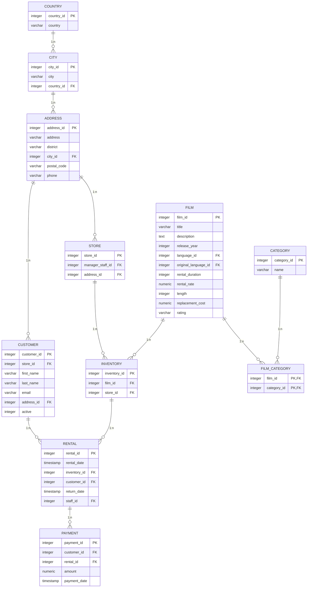
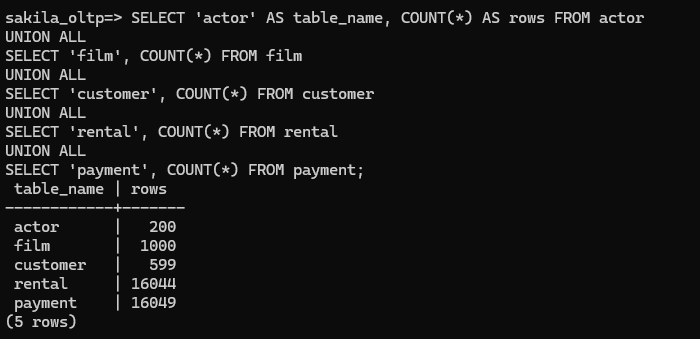
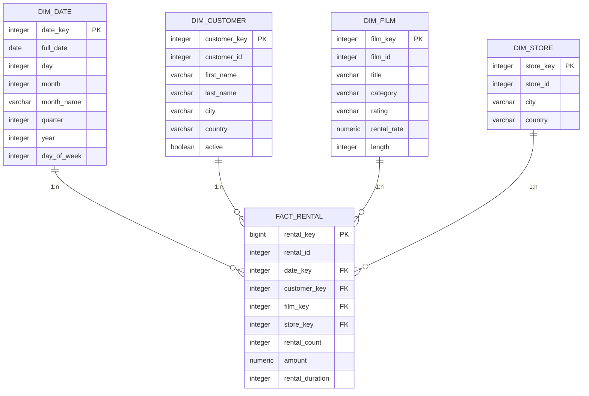
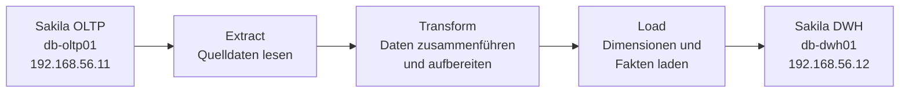
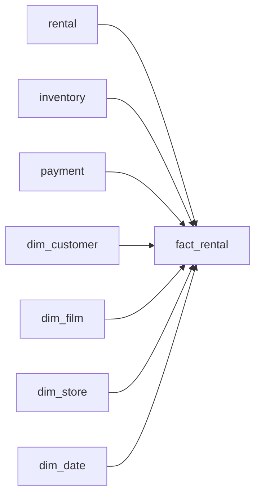
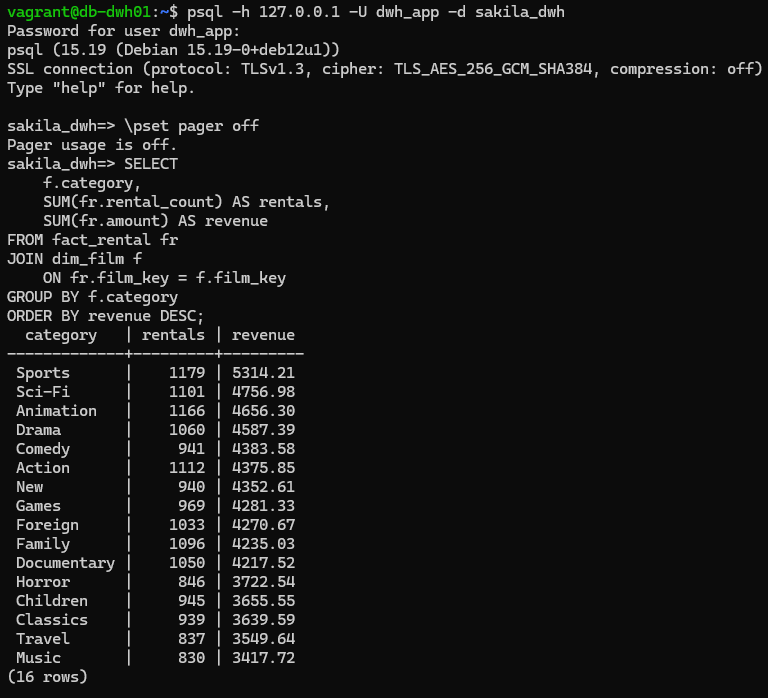
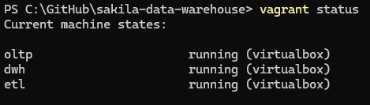

# Sakila Data Warehouse

## 1. Einleitung

### 1.1 Ausgangslage

Im Rahmen dieser Arbeit wird auf Basis der Sakila-Datenbank ein Data Warehouse aufgebaut. Sakila bildet ein operatives System für einen DVD-Verleih ab und enthält unter anderem Informationen zu Kunden, Filmen, Vermietungen, Zahlungen und Filialen.

Die relationale Quelldatenbank eignet sich für die Verarbeitung operativer Geschäftsvorgänge. Für analytische Auswertungen über mehrere Dimensionen ist eine speziell dafür aufgebaute Datenstruktur jedoch besser geeignet. Deshalb werden ausgewählte Daten aus dem operativen System in ein separates Data Warehouse überführt.

Das Projekt bildet damit einen vollständigen Datenfluss von einer OLTP-Datenbank über einen ETL-Prozess bis zu einem dimensionalen Data Warehouse mit OLAP-Auswertungen ab.

### 1.2 Zielsetzung

Ziel der Arbeit ist die Konzeption und technische Umsetzung eines reproduzierbaren Data Warehouses auf Basis der Sakila-Datenbank.

Die Lösung umfasst folgende Schwerpunkte:

- Aufbau einer PostgreSQL-Datenbank als operatives Quellsystem
- Aufbau einer separaten PostgreSQL-Datenbank als Data Warehouse
- Entwurf und Umsetzung eines Sternschemas
- Entwicklung eines ETL-Prozesses mit Python
- Übernahme und Transformation der relevanten Daten
- Durchführung analytischer SQL-Abfragen
- Verwendung von OLAP-Funktionen wie `ROLLUP` und `CUBE`
- Prüfung der Datenqualität und Vollständigkeit
- Automatisierter Aufbau der Umgebung mit Vagrant

### 1.3 Projektumfang

Die gesamte Umgebung besteht aus drei virtuellen Maschinen. Das operative Sakila-System, der ETL-Prozess und das Data Warehouse werden voneinander getrennt betrieben.

Die Quelldaten werden durch einen Python-basierten ETL-Prozess aus der OLTP-Datenbank gelesen, transformiert und anschliessend in das dimensionale Datenmodell des Data Warehouses geladen.

Der Fokus der Arbeit liegt auf der technischen Umsetzung des Datenflusses und der anschliessenden analytischen Nutzung der Daten. Die Infrastruktur und Datenbanken können automatisiert neu aufgebaut werden, wodurch die Lösung reproduzierbar ist.

## 2. Systemarchitektur

### 2.1 Übersicht

Die Projektumgebung besteht aus drei voneinander getrennten virtuellen Maschinen. Dadurch werden das operative Quellsystem, die Datenverarbeitung und das analytische Zielsystem logisch voneinander getrennt.


*Abbildung 1: Systemarchitektur und Datenfluss zwischen OLTP-System, ETL-Server und Data Warehouse.*

Der Datenfluss erfolgt vom operativen Sakila-System über den ETL-Server zum Data Warehouse. Der ETL-Prozess liest die benötigten Daten aus der Quelldatenbank, transformiert diese und schreibt die aufbereiteten Daten anschliessend in das dimensionale Datenmodell.

Die Kommunikation mit beiden PostgreSQL-Datenbanken erfolgt in Python über `psycopg2`. Auf das OLTP-System greift der ETL-Prozess nur lesend zu. Schreibzugriffe erfolgen ausschliesslich auf das Data Warehouse.

### 2.2 Komponenten

Die Umgebung besteht aus drei virtuellen Maschinen:

| System | Hostname | IP-Adresse | Aufgabe |
|---|---|---|---|
| OLTP | `db-oltp01` | `192.168.56.11` | PostgreSQL mit Sakila-Quelldatenbank |
| ETL | `etl01` | `192.168.56.13` | Python-basierte Datenextraktion, Transformation und Beladung |
| DWH | `db-dwh01` | `192.168.56.12` | PostgreSQL Data Warehouse für OLAP-Analysen |

Die virtuellen Maschinen werden mit Vagrant bereitgestellt. Die Installation und Grundkonfiguration der Systeme erfolgt automatisiert über Provisioning-Skripte.

Das OLTP-System enthält die normalisierte Sakila-Datenbank. Für den ETL-Prozess werden insbesondere Daten zu Kunden, Vermietungen, Zahlungen, Filmen, Inventar, Kategorien und Filialen verwendet.

Der ETL-Server übernimmt die Verbindung zwischen Quell- und Zielsystem. Das Python-Skript liest die benötigten Daten aus dem OLTP-System, führt die notwendigen Transformationen durch und lädt zunächst die Dimensionstabellen und anschliessend die Faktentabelle.

Das Data Warehouse verwendet ein Sternschema mit folgenden Tabellen:

- `dim_date`
- `dim_customer`
- `dim_film`
- `dim_store`
- `fact_rental`

Die zentrale Faktentabelle `fact_rental` bildet die Grundlage für die späteren analytischen SQL- und OLAP-Abfragen.

### 2.3 Verwendete Technologien

Für die Umsetzung werden folgende Technologien eingesetzt:

| Technologie | Verwendung |
|---|---|
| Vagrant | Automatisierter Aufbau der virtuellen Maschinen |
| VirtualBox | Virtualisierung der Projektumgebung |
| Debian | Betriebssystem der virtuellen Maschinen |
| PostgreSQL | OLTP- und Data-Warehouse-Datenbank |
| Python | Implementierung des ETL-Prozesses |
| psycopg2 | PostgreSQL-Zugriff aus Python |
| SQL | Datenmodellierung, Datenabfragen und OLAP-Analysen |

Durch die Trennung der drei Systeme kann jede Komponente unabhängig aufgebaut und getestet werden. Gleichzeitig lässt sich die vollständige Umgebung reproduzierbar über die im Repository enthaltene Vagrant-Konfiguration erstellen.

## 3. OLTP-Datenbank Sakila

### 3.1 Quelldatenbank

Als operatives Quellsystem wird die Sakila-Datenbank verwendet. Sie bildet die Geschäftsprozesse eines DVD-Verleihs ab und enthält unter anderem Informationen zu Kunden, Filmen, Vermietungen, Zahlungen, Inventar und Filialen.

Die Quelldatenbank wird auf dem Server `db-oltp01` mit PostgreSQL betrieben. Für das Projekt wurde sie in die Datenbank `sakila_oltp` importiert.

Sakila besitzt ein normalisiertes relationales Datenmodell. Die benötigten Informationen sind deshalb auf mehrere miteinander verknüpfte Tabellen verteilt. Für die Erstellung des Data Warehouses werden diese Daten über den ETL-Prozess zusammengeführt und in eine für analytische Abfragen geeignete Struktur transformiert.

Das folgende ER-Diagramm zeigt die für das Data Warehouse relevanten Bereiche der Quelldatenbank. Tabellen, die für den ETL-Prozess nicht benötigt werden, sind bewusst nicht dargestellt.



*Abbildung 2: Vereinfachtes ER-Diagramm der für das Data Warehouse relevanten Tabellen der Sakila-Quelldatenbank.*

**Legende der Kardinalitäten**

| Darstellung | Bedeutung |
|---|---|
| `1` | genau ein Datensatz |
| `0..n` | null bis viele Datensätze |
| `1 : n` | Eins-zu-viele-Beziehung |
| `PK` | Primary Key (Primärschlüssel) |
| `FK` | Foreign Key (Fremdschlüssel) |

### 3.2 Relevante Tabellen

Für das Data Warehouse wird nur ein Teil des vollständigen Sakila-Datenmodells benötigt. Die folgenden Tabellen bilden die Grundlage für den ETL-Prozess:

| Tabelle | Inhalt | Verwendung im Data Warehouse |
|---|---|---|
| `rental` | Vermietungsvorgänge | Grundlage der Faktentabelle `fact_rental` |
| `payment` | Zahlungen zu Vermietungen | Ermittlung der Kennzahl `amount` |
| `customer` | Kundendaten | Grundlage für `dim_customer` |
| `address` | Adressinformationen | Ermittlung geografischer Informationen |
| `city` | Städte | Stadt von Kunden und Filialen |
| `country` | Länder | Land von Kunden und Filialen |
| `inventory` | Physische Filmexemplare | Verbindung zwischen Vermietung, Film und Filiale |
| `film` | Filmdaten | Grundlage für `dim_film` |
| `film_category` | Zuordnung zwischen Film und Kategorie | Verbindung von Film und Kategorie |
| `category` | Filmkategorien | Kategorie in `dim_film` |
| `store` | Filialen | Grundlage für `dim_store` |

Die Tabelle `rental` bildet den zentralen Ausgangspunkt für die Faktendaten. Jede Vermietung verweist auf einen Kunden und ein Inventarexemplar. Über `inventory` können der zugehörige Film und die Filiale bestimmt werden.

Die Zahlungsinformationen werden über `payment` mit den Vermietungen verbunden. Dadurch kann der mit einer Vermietung verbundene Umsatz als Kennzahl in das Data Warehouse übernommen werden.

### 3.3 Transformation der relationalen Struktur

Das normalisierte OLTP-Modell ist für die Verarbeitung operativer Geschäftsvorgänge ausgelegt. Informationen, die für eine Analyse gemeinsam benötigt werden, befinden sich deshalb in mehreren miteinander verbundenen Tabellen.

Ein Beispiel ist die Filmkategorie. Im Quellsystem wird die Kategorie eines Films über folgende Tabellenbeziehung bestimmt:

`film` → `film_category` → `category`

Im Data Warehouse wird die ermittelte Kategorie direkt als Attribut in `dim_film` gespeichert. Dadurch werden spätere analytische Abfragen vereinfacht.

Ein weiteres Beispiel sind die geografischen Informationen eines Kunden. Im OLTP-System werden Stadt und Land über mehrere Tabellen bestimmt:

`customer` → `address` → `city` → `country`

Für das Data Warehouse werden die benötigten Informationen zusammengeführt und direkt in `dim_customer` gespeichert.

Bei den Filialen erfolgt die Ermittlung analog:

`store` → `address` → `city` → `country`

Stadt und Land werden anschliessend als Attribute in `dim_store` übernommen.

Das Data Warehouse übernimmt somit nicht die normalisierte Struktur des Quellsystems unverändert. Stattdessen werden die für Analysen benötigten Daten gezielt zusammengeführt und in ein dimensionales Modell überführt.

### 3.4 Umfang der Quelldaten

Nach dem Import der Sakila-Datenbank wurden die Datenbestände des Quellsystems kontrolliert. Dabei wurden unter anderem folgende Datensatzmengen festgestellt:

| Tabelle | Datensätze |
|---|---:|
| `actor` | 200 |
| `film` | 1'000 |
| `customer` | 599 |
| `rental` | 16'044 |
| `payment` | 16'049 |



*Abbildung 3: Kontrolle der Datensatzanzahlen in der operativen Sakila-Datenbank.*

Für die spätere Validierung des ETL-Prozesses ist insbesondere die Anzahl der Vermietungen relevant. Im Quellsystem befinden sich insgesamt `16'044` Vermietungen.

Nach der Durchführung des ETL-Prozesses müssen daher ebenfalls `16'044` unterschiedliche Vermietungen in der Faktentabelle `fact_rental` vorhanden sein.

Die Anzahl der Zahlungsdatensätze ist mit `16'049` etwas höher als die Anzahl der Vermietungen. Für die Übernahme in das Data Warehouse werden die Zahlungen deshalb einer Vermietung zugeordnet und für die Kennzahl `amount` entsprechend berücksichtigt.

## 4. Data-Warehouse-Design

### 4.1 Wahl des Datenmodells

Für das Data Warehouse wird ein Sternschema verwendet. Im Zentrum des Modells befindet sich die Faktentabelle `fact_rental`. Sie enthält die messbaren Werte der Vermietungsvorgänge und verweist über Fremdschlüssel auf die zugehörigen Dimensionstabellen.

Das Sternschema wurde gewählt, weil es sich besonders für analytische Abfragen eignet. Im Gegensatz zur normalisierten Struktur des OLTP-Systems werden zusammengehörige Informationen in den Dimensionen bewusst zusammengeführt. Dadurch können Auswertungen mit weniger Tabellenverknüpfungen durchgeführt werden.

Das Data Warehouse besteht aus einer Faktentabelle und vier Dimensionstabellen:

| Tabellentyp | Tabelle | Zweck |
|---|---|---|
| Fakt | `fact_rental` | Vermietungsvorgänge und Kennzahlen |
| Dimension | `dim_date` | Zeitliche Auswertungen |
| Dimension | `dim_customer` | Auswertungen nach Kunden und Herkunft |
| Dimension | `dim_film` | Auswertungen nach Filmen und Kategorien |
| Dimension | `dim_store` | Auswertungen nach Filialen |

Die Dimensionstabellen enthalten beschreibende Merkmale, während die Faktentabelle die Beziehungen zwischen den Dimensionen und die analysierbaren Kennzahlen speichert.

### 4.2 Granularität der Faktentabelle

Die Granularität definiert, was eine einzelne Zeile der Faktentabelle repräsentiert. Im entwickelten Data Warehouse entspricht eine Zeile in `fact_rental` genau einem Vermietungsvorgang.

Die Granularität lautet somit:

> Eine Zeile in `fact_rental` repräsentiert die Vermietung eines Films an einen Kunden zu einem bestimmten Zeitpunkt und über eine bestimmte Filiale.

Die ursprüngliche `rental_id` aus dem OLTP-System wird zusätzlich in der Faktentabelle gespeichert und ist eindeutig. Dadurch kann jeder Datensatz im Data Warehouse auf den ursprünglichen Vermietungsvorgang zurückgeführt werden.

Neben der `rental_id` enthält die Faktentabelle die Fremdschlüssel zu den vier Dimensionen:

- `date_key`
- `customer_key`
- `film_key`
- `store_key`

Damit kann derselbe Vermietungsvorgang aus unterschiedlichen analytischen Perspektiven betrachtet werden, beispielsweise nach Zeitraum, Kunde, Film, Kategorie, Land oder Filiale.

### 4.3 Dimensionen und Kennzahlen

#### Dimension Datum

`dim_date` stellt die zeitliche Dimension des Data Warehouses dar. Sie enthält neben dem vollständigen Datum zusätzliche Attribute wie Tag, Monat, Monatsname, Quartal, Jahr und Wochentag.

Dadurch können Vermietungen und Umsätze auf unterschiedlichen zeitlichen Ebenen ausgewertet werden.

#### Dimension Kunde

`dim_customer` enthält die für Analysen relevanten Kundendaten. Neben der ursprünglichen `customer_id` werden Vorname, Nachname, Stadt, Land und der Aktivstatus gespeichert.

Die geografischen Informationen stammen im OLTP-System aus mehreren Tabellen. Für das Data Warehouse werden diese Informationen zusammengeführt und direkt in der Kundendimension abgelegt.

#### Dimension Film

`dim_film` enthält Informationen zu den ausgeliehenen Filmen. Gespeichert werden unter anderem Titel, Kategorie, Altersfreigabe beziehungsweise Rating, Mietpreis und Filmlänge.

Die Kategorie wird im OLTP-System über `film_category` und `category` ermittelt und im Data Warehouse direkt in `dim_film` gespeichert. Dadurch werden spätere Auswertungen nach Filmkategorie vereinfacht.

#### Dimension Filiale

`dim_store` beschreibt die Filiale, der das vermietete Inventarexemplar zugeordnet ist. Neben der ursprünglichen `store_id` werden Stadt und Land gespeichert.

Dadurch können Vermietungen und Umsätze zwischen den verschiedenen Filialen verglichen werden.

#### Kennzahlen

Die Faktentabelle `fact_rental` enthält folgende Kennzahlen:

| Kennzahl | Bedeutung |
|---|---|
| `rental_count` | Anzahl der Vermietungen; pro Faktzeile wird der Wert `1` gespeichert |
| `amount` | Zahlungsbetrag beziehungsweise Umsatz der Vermietung |
| `rental_duration` | Dauer der Vermietung in Tagen |

`rental_count` ist eine additive Kennzahl. Durch Summieren des Wertes können Vermietungen für beliebige Dimensionen gezählt werden.

`amount` ermöglicht Umsatzanalysen beispielsweise nach Zeitraum, Filmkategorie, Kunde, Land oder Filiale.

`rental_duration` ermöglicht die Analyse der durchschnittlichen Vermietungsdauer. Da nicht jede Vermietung zwingend bereits abgeschlossen sein muss, kann dieser Wert bei fehlendem Rückgabedatum keinen Wert enthalten.

Die Kombination aus Faktentabelle und Dimensionen bildet die Grundlage für die späteren OLAP-Abfragen.

## 5. Sternschema

### 5.1 Aufbau des Sternschemas

Das Data Warehouse wurde als Sternschema umgesetzt. Im Zentrum steht die Faktentabelle `fact_rental`. Sie ist über Fremdschlüssel direkt mit den vier Dimensionstabellen `dim_date`, `dim_customer`, `dim_film` und `dim_store` verbunden.

Das folgende Diagramm entspricht dem tatsächlich implementierten Datenbankschema:



*Abbildung 4: Sternschema des implementierten Sakila Data Warehouses.*

**Legende**

| Darstellung | Bedeutung |
|---|---|
| `1:n` | Eins-zu-viele-Beziehung |
| `PK` | Primary Key (Primärschlüssel) |
| `FK` | Foreign Key (Fremdschlüssel) |

Jeder Datensatz einer Dimension kann mit mehreren Vermietungen in `fact_rental` verbunden sein. Eine Faktzeile verweist dagegen jeweils auf einen Datensatz der entsprechenden Dimension.

### 5.2 Faktentabelle `fact_rental`

Die Tabelle `fact_rental` bildet das Zentrum des Sternschemas. Jede Zeile repräsentiert einen einzelnen Vermietungsvorgang.

Als technischer Primärschlüssel wird `rental_key` verwendet. Zusätzlich wird die ursprüngliche `rental_id` aus dem OLTP-System gespeichert. Sie ist im Data Warehouse eindeutig und ermöglicht die Zuordnung einer Faktzeile zum ursprünglichen Vermietungsvorgang.

Über die Fremdschlüssel

- `date_key`
- `customer_key`
- `film_key`
- `store_key`

ist jede Faktzeile mit den zugehörigen Dimensionen verbunden.

Die Faktentabelle enthält drei Kennzahlen:

| Kennzahl | Verwendung |
|---|---|
| `rental_count` | Zählen und Aggregieren von Vermietungen |
| `amount` | Umsatzanalysen |
| `rental_duration` | Analyse der Vermietungsdauer |

Durch die zentrale Faktentabelle können dieselben Kennzahlen aus verschiedenen Perspektiven analysiert werden.

### 5.3 Dimensionstabellen

Die Dimension `dim_date` ermöglicht zeitbezogene Analysen. Neben dem vollständigen Datum enthält sie Attribute für Tag, Monat, Monatsname, Quartal, Jahr und Wochentag. Dadurch können Kennzahlen auf unterschiedlichen Zeitebenen aggregiert werden.

Die Dimension `dim_customer` enthält die für Analysen relevanten Kundeninformationen. Neben der ursprünglichen `customer_id` werden Name, Stadt, Land und Aktivstatus gespeichert. Die geografischen Informationen wurden während des ETL-Prozesses aus dem normalisierten OLTP-Modell zusammengeführt.

Die Dimension `dim_film` beschreibt die ausgeliehenen Filme. Sie enthält die ursprüngliche `film_id`, den Titel, die Kategorie, das Rating, den Mietpreis und die Filmlänge. Insbesondere die direkte Speicherung der Kategorie vereinfacht Auswertungen nach Filmkategorien.

Die Dimension `dim_store` enthält die ursprüngliche `store_id` sowie Stadt und Land der Filiale. Dadurch können Vermietungen und Umsätze zwischen den Filialen verglichen werden.

### 5.4 Surrogate Keys

Die Dimensionstabellen verwenden eigene technische Schlüssel:

| Dimension | Surrogate Key | Quellschlüssel |
|---|---|---|
| `dim_customer` | `customer_key` | `customer_id` |
| `dim_film` | `film_key` | `film_id` |
| `dim_store` | `store_key` | `store_id` |

Die Faktentabelle verwendet diese Surrogate Keys als Fremdschlüssel. Dadurch ist das dimensionale Modell von den technischen Beziehungen des OLTP-Systems getrennt.

Bei `dim_date` wird mit `date_key` ein Datumsschlüssel im Format `YYYYMMDD` verwendet. Beispielsweise kann der 24. Mai 2005 durch den Schlüssel `20050524` repräsentiert werden.

### 5.5 Unterschied zum OLTP-Modell

Der wesentliche Unterschied zwischen OLTP-System und Data Warehouse liegt in der Modellierung.

Das OLTP-System ist normalisiert und verteilt Informationen auf zahlreiche miteinander verknüpfte Tabellen. Dies reduziert Redundanzen und eignet sich für operative Transaktionen.

Das Data Warehouse ist dagegen für analytische Abfragen optimiert. Benötigte Informationen werden in wenigen Dimensionstabellen zusammengeführt und über die zentrale Faktentabelle miteinander verbunden.

Beispielsweise benötigt eine Analyse nach Filmkategorie im OLTP-System mehrere Tabellen:

`rental` → `inventory` → `film` → `film_category` → `category`

Im Data Warehouse reduziert sich dieser Zugriff auf:

`fact_rental` → `dim_film`

Die Kategorie ist bereits als Attribut in `dim_film` vorhanden. Dadurch wird die Struktur analytischer Abfragen einfacher und übersichtlicher.

## 6. ETL-Prozess

### 6.1 Aufgabe des ETL-Prozesses

Der ETL-Prozess bildet die Verbindung zwischen der operativen Sakila-Datenbank und dem Data Warehouse. ETL steht für Extract, Transform und Load.

Der Prozess wird auf der separaten virtuellen Maschine `etl01` ausgeführt und ist in Python implementiert. Für die Kommunikation mit den beiden PostgreSQL-Datenbanken wird `psycopg2` verwendet.

Der Datenfluss erfolgt ausschliesslich in eine Richtung:

`Sakila OLTP` → `Python ETL` → `Sakila DWH`

Der ETL-Server greift lesend auf das OLTP-System `db-oltp01` zu. Die extrahierten Daten werden in Python verarbeitet und anschliessend in das Data Warehouse auf `db-dwh01` geschrieben.

### 6.2 Ablauf

Der ETL-Prozess besteht aus drei grundlegenden Phasen:



*Abbildung 5: Grundlegender Ablauf des ETL-Prozesses.*

In der Extract-Phase werden die benötigten Datensätze aus der normalisierten Sakila-Datenbank gelesen.

Während der Transform-Phase werden Informationen aus mehreren Quelltabellen zusammengeführt und für das dimensionale Datenmodell aufbereitet. Dazu gehören beispielsweise die Ermittlung geografischer Informationen, die Zuordnung der Filmkategorie sowie die Berechnung der Vermietungsdauer.

In der Load-Phase werden zunächst die Dimensionstabellen und anschliessend die Faktentabelle geladen.

### 6.3 Laden der Dimensionen

Die Dimensionen werden vor der Faktentabelle geladen, da `fact_rental` über Fremdschlüssel auf die Dimensionstabellen verweist.

Die Reihenfolge des ETL-Prozesses lautet:

1. `dim_date`
2. `dim_customer`
3. `dim_film`
4. `dim_store`
5. `fact_rental`

#### `dim_date`

Die Datumsdimension wird aus den in den Vermietungen vorkommenden Datumswerten aufgebaut. Für jedes Datum werden zusätzliche Attribute wie Tag, Monat, Monatsname, Quartal, Jahr und Wochentag erzeugt.

Der `date_key` wird im Format `YYYYMMDD` gebildet.

#### `dim_customer`

Für die Kundendimension werden Informationen aus mehreren Tabellen des OLTP-Systems zusammengeführt:

`customer` → `address` → `city` → `country`

Dadurch können Stadt und Land direkt in `dim_customer` gespeichert werden.

#### `dim_film`

Für die Filmdimension werden die Filmdaten mit den Kategorien verbunden:

`film` → `film_category` → `category`

Die ermittelte Kategorie wird direkt als Attribut in `dim_film` übernommen.

#### `dim_store`

Auch die geografischen Informationen der Filialen werden aus mehreren Tabellen ermittelt:

`store` → `address` → `city` → `country`

Stadt und Land werden anschliessend direkt in `dim_store` gespeichert.

### 6.4 Laden der Faktentabelle

Nachdem die Dimensionstabellen geladen wurden, wird `fact_rental` aufgebaut.

Ausgangspunkt ist die Tabelle `rental`. Über die Beziehungen des OLTP-Systems werden die benötigten Informationen zu Kunde, Film, Filiale und Zahlung ermittelt.

Vereinfacht lässt sich die Transformation folgendermassen darstellen:



*Abbildung 6: Zusammenführung der Daten für die Faktentabelle `fact_rental`.*

Für jede Vermietung werden die zugehörigen Surrogate Keys der Dimensionstabellen ermittelt. Anschliessend wird eine Faktzeile mit den entsprechenden Fremdschlüsseln und Kennzahlen erzeugt.

Die Faktentabelle enthält dabei unter anderem:

| Attribut | Herkunft beziehungsweise Berechnung |
|---|---|
| `rental_id` | ursprüngliche ID aus `rental` |
| `date_key` | aus `rental_date` abgeleiteter Datumsschlüssel |
| `customer_key` | über `customer_id` in `dim_customer` ermittelt |
| `film_key` | über `inventory` und `film_id` ermittelt |
| `store_key` | über `inventory` und `store_id` ermittelt |
| `rental_count` | konstanter Wert `1` pro Vermietung |
| `amount` | Zahlungsbetrag der Vermietung |
| `rental_duration` | Dauer zwischen Vermietung und Rückgabe |

### 6.5 Idempotenz

Der ETL-Prozess wurde so implementiert, dass er mehrfach ausgeführt werden kann, ohne die Faktendaten zu duplizieren.

Die ursprüngliche `rental_id` ist in `fact_rental` eindeutig. Beim Laden der Faktendaten wird diese ID verwendet, um bereits vorhandene Vermietungen zu erkennen.

Technisch wird dafür beim Einfügen der Faktendaten ein `ON CONFLICT`-Mechanismus verwendet. Existiert eine `rental_id` bereits, wird der bestehende Datensatz aktualisiert, anstatt eine zweite Faktzeile anzulegen.

Dieses Verhalten wurde durch zwei aufeinanderfolgende ETL-Ausführungen überprüft. Nach dem ersten Lauf enthielt `fact_rental`:

```text
16044 Datensätze
```

Nach einer zweiten vollständigen Ausführung enthielt die Tabelle weiterhin:

```text
16044 Datensätze
```

Damit wurde bestätigt, dass eine erneute Ausführung des ETL-Prozesses keine doppelten Vermietungen erzeugt.

### 6.6 Ausführung

Der ETL-Prozess befindet sich im Repository unter:

```text
etl/load_dwh.py
```

Er wird innerhalb der ETL-VM ausgeführt. Die benötigte Python-Umgebung wird beim Provisionieren der virtuellen Maschine automatisch eingerichtet.

Während der Ausführung gibt das Skript den Fortschritt der einzelnen Ladevorgänge aus. Eine erfolgreiche vollständige Ausführung liefert beispielsweise:

```text
=== ETL gestartet ===
OLTP rental: 16044
DWH fact_rental: 0
dim_date geladen: 41 Datumswerte
dim_customer geladen: 599 Kunden
dim_film geladen: 1000 Filme
dim_store geladen: 2 Filialen
fact_rental geladen: 16044 Vermietungen
=== ETL abgeschlossen ===
```


*Abbildung 7: Erfolgreiche Ausführung des Python-ETL-Prozesses auf `etl01`. Die bereits geladenen 16'044 Faktendatensätze bleiben auch bei erneuter Ausführung erhalten.*

Damit lässt sich unmittelbar kontrollieren, ob die Dimensionen und die Faktentabelle erfolgreich geladen wurden.

## 7. OLAP-Analysen

### 7.1 Ziel der Analysen

Nach dem Laden des Data Warehouses können die Vermietungsdaten aus verschiedenen Perspektiven analysiert werden. Die dafür erstellten SQL-Abfragen befinden sich unter:

```text
sql/olap/01_analysen.sql
```

Die Analysen verwenden die zentrale Faktentabelle `fact_rental` und kombinieren deren Kennzahlen mit den Dimensionen Datum, Kunde, Film und Filiale.

Dadurch lassen sich unter anderem folgende Fragestellungen untersuchen:

- Wie entwickeln sich Vermietungen und Umsätze über die Zeit?
- Welche Filmkategorien erzielen die höchsten Umsätze?
- Wie unterscheiden sich die beiden Filialen?
- Welche Filme werden besonders häufig ausgeliehen?
- Welche Kunden erzielen die höchsten Umsätze?
- Aus welchen Ländern stammen die Kunden?
- Wie unterscheidet sich die durchschnittliche Vermietungsdauer zwischen den Filmkategorien?

### 7.2 Gesamtübersicht

Das Data Warehouse enthält insgesamt `16'044` Vermietungen. Der über die Faktentabelle ermittelte Gesamtumsatz beträgt:

```text
67'416.51
```

Damit ergibt sich ein durchschnittlicher Umsatz von rund `4.20` pro Vermietung.

Die durchschnittliche Vermietungsdauer liegt bei ungefähr `4.53` Tagen.

Diese Kennzahlen bilden eine kompakte Gesamtübersicht über die im Data Warehouse enthaltenen Vermietungsvorgänge.

### 7.3 Zeitliche Entwicklung

Durch die Dimension `dim_date` können Vermietungen und Umsätze nach Jahr und Monat aggregiert werden.

Die vorhandenen Daten verteilen sich auf folgende Monate:

| Jahr | Monat | Vermietungen | Umsatz |
|---:|---|---:|---:|
| 2005 | Mai | 1'156 | 4'833.39 |
| 2005 | Juni | 2'311 | 9'629.89 |
| 2005 | Juli | 6'709 | 28'368.91 |
| 2005 | August | 5'686 | 24'070.14 |
| 2006 | Februar | 182 | 514.18 |

Der grösste Teil der im Datensatz enthaltenen Vermietungen liegt im Jahr 2005:

| Jahr | Vermietungen | Umsatz |
|---:|---:|---:|
| 2005 | 15'862 | 66'902.33 |
| 2006 | 182 | 514.18 |

Die Analyse zeigt, dass insbesondere Juli und August 2005 einen grossen Anteil der vorhandenen Vermietungen und Umsätze ausmachen. Diese Aussage beschreibt die Verteilung innerhalb des vorhandenen Sakila-Datensatzes und stellt keine allgemeine saisonale Aussage über DVD-Vermietungen dar.

### 7.4 Analyse nach Filmkategorie

Durch die direkte Speicherung der Kategorie in `dim_film` können Umsätze und Vermietungen einfach nach Filmkategorie aggregiert werden.

Beispielsweise ergeben sich für einige der umsatzstärkeren Kategorien folgende Werte:

| Kategorie | Vermietungen | Umsatz |
|---|---:|---:|
| Sports | 1'179 | 5'314.21 |
| Sci-Fi | 1'101 | 4'756.98 |
| Animation | 1'166 | 4'656.30 |
| Drama | 1'060 | 4'587.39 |
| Comedy | 941 | 4'383.58 |
| Action | 1'112 | 4'375.85 |



*Abbildung 8: Ausführung einer OLAP-Abfrage auf dem Data Warehouse. Die Vermietungen und Umsätze werden nach Filmkategorie aggregiert.*

Neben dem Gesamtumsatz kann auch der durchschnittliche Umsatz pro Vermietung betrachtet werden. Bei `Comedy` beträgt dieser beispielsweise rund `4.66`, bei `Sports` rund `4.51`.

Damit kann dieselbe Dimension sowohl für absolute Kennzahlen als auch für Durchschnittswerte verwendet werden.

### 7.5 Vergleich der Filialen

Die Dimension `dim_store` ermöglicht einen direkten Vergleich der beiden im Datensatz vorhandenen Filialen:

| Store | Stadt | Land | Vermietungen | Umsatz |
|---:|---|---|---:|---:|
| 1 | Lethbridge | Canada | 7'923 | 33'689.74 |
| 2 | Woodridge | Australia | 8'121 | 33'726.77 |

Die beiden Filialen weisen im vorhandenen Datensatz ähnliche Gesamtumsätze auf. Store 2 enthält etwas mehr Vermietungen und erzielt einen geringfügig höheren Gesamtumsatz.

Die Kombination von `dim_store` und `dim_date` erlaubt zusätzlich eine Analyse der Filialen nach Jahr oder anderen Zeitperioden.

### 7.6 Analyse nach Film und Kunde

Neben aggregierten Auswertungen nach Kategorie oder Filiale können auch einzelne Filme und Kunden untersucht werden.

Bei einer Sortierung nach Umsatz gehören beispielsweise folgende Filme zu den auffälligen Datensätzen:

| Film | Kategorie | Vermietungen | Umsatz |
|---|---|---:|---:|
| TELEGRAPH VOYAGE | Music | 27 | 231.73 |
| WIFE TURN | Documentary | 31 | 223.69 |
| ZORRO ARK | Comedy | 31 | 214.69 |
| GOODFELLAS SALUTE | Sci-Fi | 31 | 209.69 |
| SATURDAY LAMBS | Sports | 28 | 204.72 |

Über `dim_customer` können dieselben Kennzahlen nach einzelnen Kunden sowie nach Stadt oder Land aggregiert werden.

### 7.7 Geografische Analyse

Da Stadt und Land während des ETL-Prozesses in die Kundendimension übernommen werden, können die Kennzahlen auch geografisch ausgewertet werden.

Die Länder mit den höchsten Umsätzen im vorhandenen Datensatz sind unter anderem:

| Land | Vermietungen | Umsatz |
|---|---:|---:|
| India | 1'572 | 6'628.28 |
| China | 1'426 | 5'798.74 |
| United States | 968 | 4'110.32 |
| Japan | 825 | 3'470.75 |
| Mexico | 796 | 3'307.04 |

Diese Analyse zeigt gleichzeitig einen Vorteil der dimensionalen Modellierung: Die geografischen Informationen müssen bei der Analyse nicht erneut über `customer`, `address`, `city` und `country` zusammengesetzt werden, sondern stehen direkt in `dim_customer` zur Verfügung.

### 7.8 OLAP mit ROLLUP und CUBE

Neben klassischen Aggregationen wurden auch die PostgreSQL-Funktionen `ROLLUP` und `CUBE` eingesetzt.

Mit `ROLLUP` können hierarchische Aggregationen innerhalb einer Abfrage erzeugt werden. Bei der Analyse von Jahr und Monat werden beispielsweise Monatswerte, Jahressummen und die Gesamtsumme gemeinsam ausgegeben.

Ein Ausschnitt der `ROLLUP`-Analyse ergibt:

| Jahr | Monat | Umsatz |
|---:|---:|---:|
| 2005 | 5 | 4'833.39 |
| 2005 | 6 | 9'629.89 |
| 2005 | 7 | 28'368.91 |
| 2005 | 8 | 24'070.14 |
| 2005 | Gesamt | 66'902.33 |
| 2006 | 2 | 514.18 |
| 2006 | Gesamt | 514.18 |
| Gesamt | Gesamt | 67'416.51 |

`CUBE` erweitert dieses Prinzip und erzeugt Aggregationen für mehrere Kombinationen von Dimensionen.

Bei der Kombination von Jahr und Filiale können beispielsweise Werte pro Jahr und Filiale, Jahressummen, Filialsummen und die Gesamtsumme innerhalb einer Abfrage berechnet werden.

Das Ergebnis enthält unter anderem:

| Jahr | Store | Umsatz |
|---:|---:|---:|
| 2005 | 1 | 33'446.64 |
| 2005 | 2 | 33'455.69 |
| 2005 | Gesamt | 66'902.33 |
| 2006 | 1 | 243.10 |
| 2006 | 2 | 271.08 |
| 2006 | Gesamt | 514.18 |
| Gesamt | 1 | 33'689.74 |
| Gesamt | 2 | 33'726.77 |
| Gesamt | Gesamt | 67'416.51 |

Damit werden neben einfachen `GROUP BY`-Auswertungen auch typische OLAP-Operationen auf dem dimensionalen Datenmodell demonstriert.

### 7.9 Drill-down und Roll-up

Die Zeitdimension ermöglicht unterschiedliche Aggregationsebenen.

Ein Roll-up kann beispielsweise von Monatswerten zu Jahreswerten erfolgen:

`Monat` → `Jahr`

Umgekehrt ermöglicht ein Drill-down die Betrachtung detaillierterer Ebenen:

`Jahr` → `Monat` → `Datum`

Dasselbe Prinzip kann auch auf andere Dimensionen angewendet werden. Beispielsweise kann eine geografische Analyse zunächst auf Länderebene und anschliessend detaillierter nach Städten durchgeführt werden.

Die implementierten Analysen zeigen damit, dass das Sternschema nicht nur zur Speicherung der transformierten Daten dient, sondern gezielt für mehrdimensionale analytische Abfragen eingesetzt werden kann.

## 8. Testing und Validierung

### 8.1 Ziel der Validierung

Nach der Durchführung des ETL-Prozesses wurde überprüft, ob die Daten vollständig und konsistent in das Data Warehouse übernommen wurden.

Die Prüfungen konzentrieren sich insbesondere auf folgende Punkte:

- Anzahl der geladenen Vermietungen
- Eindeutigkeit der `rental_id`
- Übereinstimmung der aggregierten Umsätze
- Gültigkeit der Fremdschlüssel zu den Dimensionstabellen
- Verhalten bei mehrfacher Ausführung des ETL-Prozesses

Die dafür verwendeten SQL-Abfragen befinden sich unter:

```text
sql/olap/02_quality_checks.sql
```

### 8.2 Vollständigkeit der Faktentabelle

Die Quelldatenbank enthält insgesamt `16'044` Vermietungen. Nach dem ETL-Prozess wurde die Anzahl der Datensätze in `fact_rental` überprüft.

Das Ergebnis lautet:

| Prüfung | Ergebnis |
|---|---:|
| Datensätze in `fact_rental` | 16'044 |
| Eindeutige `rental_id` | 16'044 |
| Summe `rental_count` | 16'044 |

Die Anzahl der Faktendatensätze entspricht damit der Anzahl der Vermietungen in der Quelldatenbank.

Da gleichzeitig `16'044` unterschiedliche `rental_id` vorhanden sind, existiert für jede Vermietung genau eine Faktzeile.

Die Summe von `rental_count` beträgt ebenfalls `16'044`. Dies entspricht dem definierten Grain der Faktentabelle, bei dem jede Faktzeile genau eine Vermietung repräsentiert.

### 8.3 Validierung des Umsatzes

Zusätzlich zur Anzahl der Datensätze wurde die Kennzahl `amount` überprüft.

In der operativen Sakila-Datenbank ergibt die Summe der Zahlungsbeträge:

```text
67'416.51
```

Die Summe von `amount` in `fact_rental` ergibt ebenfalls:

```text
67'416.51
```

Damit stimmen Quell- und Zielsystem beim Gesamtumsatz exakt überein.

Dies ist insbesondere relevant, da in der Quelldatenbank `16'049` Zahlungsdatensätze, aber nur `16'044` Vermietungen vorhanden sind. Die Zahlungsinformationen werden während des ETL-Prozesses einer Vermietung zugeordnet beziehungsweise pro Vermietung aggregiert.

Dadurch bleibt die definierte Granularität von einer Zeile pro Vermietung erhalten, ohne dass Zahlungsbeträge verloren gehen.

### 8.4 Prüfung der Dimensionsschlüssel

Die Fremdschlüssel der Faktentabelle wurden zusätzlich auf ungültige Referenzen überprüft.

Dabei wurden folgende Ergebnisse ermittelt:

| Prüfung | Ungültige Schlüssel |
|---|---:|
| `customer_key` | 0 |
| `film_key` | 0 |
| `store_key` | 0 |
| `date_key` | 0 |

Damit konnte für jede Faktzeile eine gültige Zuordnung zu Kunde, Film, Filiale und Datum hergestellt werden.

Die Prüfung ist besonders wichtig, da die Surrogate Keys während des ETL-Prozesses anhand der ursprünglichen IDs aus dem OLTP-System ermittelt werden.


*Abbildung 9: Ausführung der Qualitätsprüfungen auf dem Data Warehouse. Die Faktentabelle enthält 16'044 eindeutige Vermietungen, der Gesamtumsatz beträgt 67'416.51 und es wurden keine ungültigen Dimensionsschlüssel festgestellt.*

### 8.5 Idempotenz des ETL-Prozesses

Neben der inhaltlichen Datenqualität wurde überprüft, wie sich eine erneute Ausführung des ETL-Prozesses auf das Data Warehouse auswirkt.

Nach der ersten vollständigen Ausführung enthielt `fact_rental`:

```text
16'044 Datensätze
```

Anschliessend wurde der ETL-Prozess erneut vollständig ausgeführt.

Vor dem zweiten Ladevorgang meldete das Skript bereits:

```text
OLTP rental: 16044
DWH fact_rental: 16044
```

Nach Abschluss des zweiten Durchlaufs enthielt `fact_rental` weiterhin:

```text
16'044 Datensätze
```

Der ETL-Prozess erzeugt somit bei einer erneuten Ausführung keine zusätzlichen Faktzeilen für bereits vorhandene Vermietungen.

Dies wird durch die eindeutige `rental_id` in `fact_rental` und die Verwendung von `ON CONFLICT` beim Laden der Faktendaten erreicht.

### 8.6 Zusammenfassung der Testergebnisse

Die durchgeführten Prüfungen ergeben folgenden Stand:

| Test | Erwartetes Ergebnis | Tatsächliches Ergebnis |
|---|---:|---:|
| Anzahl Vermietungen | 16'044 | 16'044 |
| Eindeutige `rental_id` | 16'044 | 16'044 |
| Summe `rental_count` | 16'044 | 16'044 |
| Gesamtumsatz | 67'416.51 | 67'416.51 |
| Ungültige `customer_key` | 0 | 0 |
| Ungültige `film_key` | 0 | 0 |
| Ungültige `store_key` | 0 | 0 |
| Ungültige `date_key` | 0 | 0 |
| Faktzeilen nach zweitem ETL-Lauf | 16'044 | 16'044 |

Die Ergebnisse zeigen, dass die für das Projekt definierten Konsistenzprüfungen erfolgreich erfüllt werden. Die Anzahl der Vermietungen und der Gesamtumsatz stimmen zwischen Quell- und Zielsystem überein. Gleichzeitig bestehen keine ungültigen Verweise zwischen Fakt- und Dimensionstabellen und eine wiederholte ETL-Ausführung erzeugt keine Duplikate.

## 9. Reproduzierbarkeit und Installation

### 9.1 Ziel

Die gesamte Projektumgebung wurde so aufgebaut, dass sie aus dem Git-Repository reproduziert werden kann. Die virtuellen Maschinen selbst werden nicht im Repository gespeichert. Stattdessen enthält das Projekt alle notwendigen Konfigurations-, Provisionierungs-, SQL- und ETL-Dateien.

Dadurch kann die Infrastruktur mit Vagrant und VirtualBox neu erstellt werden.

Die Umgebung besteht aus drei virtuellen Maschinen:

| Maschine | Hostname | IP-Adresse | Aufgabe |
|---|---|---|---|
| `oltp` | `db-oltp01` | `192.168.56.11` | PostgreSQL mit Sakila-Quelldatenbank |
| `etl` | `etl01` | `192.168.56.13` | Python-ETL-Prozess |
| `dwh` | `db-dwh01` | `192.168.56.12` | PostgreSQL Data Warehouse |

Als Basis der virtuellen Maschinen wird eine Debian-Vagrant-Box verwendet.

### 9.2 Voraussetzungen

Für die lokale Ausführung werden folgende Komponenten benötigt:

- Git
- Vagrant
- VirtualBox

PostgreSQL, Python und die benötigten Python-Pakete müssen nicht manuell auf dem Host installiert werden. Diese Komponenten werden innerhalb der virtuellen Maschinen durch die Provisionierung eingerichtet.

### 9.3 Repository klonen

Zuerst wird das Projekt über Git geklont:

```bash
git clone https://github.com/t-rasiah/sakila-data-warehouse.git
cd sakila-data-warehouse
```

Das Repository enthält unter anderem folgende für die Reproduzierbarkeit relevanten Bestandteile:

```text
sakila-data-warehouse/
├── Vagrantfile
├── provisioning/
│   ├── oltp.sh
│   ├── dwh.sh
│   └── etl.sh
├── sql/
│   ├── oltp/
│   ├── dwh/
│   └── olap/
├── etl/
│   └── load_dwh.py
└── docs/
```

Die virtuellen Festplatten und lokalen Vagrant-Artefakte sind nicht Bestandteil des Repositorys.

### 9.4 Virtuelle Maschinen erstellen

Im Hauptverzeichnis des Projekts wird die komplette Infrastruktur mit folgendem Befehl erstellt:

```bash
vagrant up
```

Vagrant erstellt und provisioniert dabei die drei Maschinen `oltp`, `etl` und `dwh`.

Während der Provisionierung werden die benötigten Softwarepakete installiert und die Datenbanken vorbereitet.

Auf `db-oltp01` wird PostgreSQL installiert und die Sakila-Quelldatenbank `sakila_oltp` eingerichtet.

Auf `db-dwh01` wird PostgreSQL installiert und die Datenbank `sakila_dwh` mit dem definierten Sternschema vorbereitet.

Auf `etl01` werden Python, die virtuelle Python-Umgebung und der PostgreSQL-Treiber `psycopg2` eingerichtet.

### 9.5 Status der Infrastruktur prüfen

Nach Abschluss der Provisionierung kann der Status aller Maschinen auf dem Host überprüft werden:

```bash
vagrant status
```

Alle drei Maschinen sollten den Zustand `running` aufweisen.



*Abbildung 10: Status der drei über Vagrant bereitgestellten virtuellen Maschinen `oltp`, `dwh` und `etl`.*

Damit lässt sich überprüfen, ob die vollständige Infrastruktur erfolgreich erstellt und gestartet wurde.

### 9.6 ETL-Prozess ausführen

Nach dem Aufbau der Infrastruktur kann eine Verbindung zur ETL-Maschine hergestellt werden:

```bash
vagrant ssh etl
```

Innerhalb der virtuellen Maschine wird der ETL-Prozess aus dem eingebundenen Projektverzeichnis gestartet:

```bash
cd /vagrant
/opt/sakila-etl/venv/bin/python etl/load_dwh.py
```

Das Skript verbindet sich mit der OLTP-Datenbank auf `db-oltp01`, transformiert die benötigten Daten und lädt sie in das Data Warehouse auf `db-dwh01`.

Nach erfolgreicher Ausführung enthält `fact_rental` insgesamt `16'044` Vermietungen.

### 9.7 OLAP-Abfragen ausführen

Für eine direkte Analyse kann eine Verbindung zur DWH-Maschine hergestellt werden:

```bash
vagrant ssh dwh
```

Anschliessend kann das Data Warehouse mit `psql` geöffnet werden:

```bash
psql -h 127.0.0.1 -U dwh_app -d sakila_dwh
```

Die implementierten OLAP-Abfragen befinden sich unter:

```text
sql/olap/01_analysen.sql
```

Die Qualitätsprüfungen befinden sich unter:

```text
sql/olap/02_quality_checks.sql
```

Damit stehen sowohl die analytischen Abfragen als auch die Prüfungen der geladenen Daten direkt im Repository zur Verfügung.

### 9.8 Neuaufbau der Umgebung

Um die Reproduzierbarkeit zu überprüfen, kann die gesamte virtuelle Infrastruktur entfernt und anschliessend neu erstellt werden.

Die bestehenden Vagrant-Maschinen werden auf dem Host mit folgendem Befehl entfernt:

```bash
vagrant destroy -f
```

Danach wird die Umgebung erneut aufgebaut:

```bash
vagrant up
```

Nach Abschluss der Provisionierung kann der ETL-Prozess erneut ausgeführt werden:

```bash
vagrant ssh etl
```

Innerhalb von `etl01`:

```bash
cd /vagrant
/opt/sakila-etl/venv/bin/python etl/load_dwh.py
```

Dieser vollständige Neuaufbau wurde während der Entwicklung getestet. Nach dem erneuten Erstellen der Umgebung konnte der ETL-Prozess erfolgreich ausgeführt werden und lud erneut `16'044` Vermietungen in das Data Warehouse.

Damit ist die technische Umgebung nicht von bereits bestehenden virtuellen Maschinen oder manuell eingerichteten Datenbanken abhängig.

### 9.9 Versionsverwaltung und ausgeschlossene Dateien

Die für den Aufbau benötigten Dateien werden mit Git versioniert. Lokale oder grosse Virtualisierungsdateien werden dagegen über `.gitignore` ausgeschlossen.

Dazu gehören insbesondere:

```text
.vagrant/
*.vdi
*.vmdk
*.vbox
*.vbox-prev
*.box
```

Dadurch enthält das Repository keine vollständigen virtuellen Maschinen, sondern nur die Dateien, die für deren reproduzierbare Erstellung benötigt werden.

Zusätzlich werden lokale Entwicklungsdateien, Python-Cache-Dateien und Umgebungsdateien ausgeschlossen.

### 9.10 Reproduzierbarer Ablauf

Der vollständige Ablauf lässt sich damit auf folgende Schritte reduzieren:

```text
Git Repository klonen
        |
        v
    vagrant up
        |
        v
OLTP + ETL + DWH
werden provisioniert
        |
        v
ETL-Prozess starten
        |
        v
Data Warehouse laden
        |
        v
OLAP-Abfragen und
Qualitätsprüfungen
```

Die Kombination aus Vagrant, Provisionierungsskripten, versionierten SQL-Dateien und dem Python-ETL-Prozess ermöglicht es, die entwickelte Umgebung aus dem Repository neu aufzubauen und die Ergebnisse erneut zu erzeugen.

## 10. Fazit und Ausblick

### 10.1 Fazit

Im Rahmen dieses Projekts wurde auf Basis der relationalen Sakila-Datenbank ein eigenständiges Data Warehouse für analytische Auswertungen aufgebaut.

Die Ausgangsdaten liegen in einer normalisierten PostgreSQL-Datenbank vor. Für analytische Abfragen wurde daraus ein Sternschema mit der zentralen Faktentabelle `fact_rental` sowie den Dimensionstabellen `dim_date`, `dim_customer`, `dim_film` und `dim_store` entwickelt.

Die Übertragung der Daten erfolgt über einen in Python implementierten ETL-Prozess. Dieser liest die benötigten Daten aus dem OLTP-System, führt Informationen aus mehreren Tabellen zusammen und lädt die transformierten Daten in das Data Warehouse.

Das resultierende Data Warehouse enthält `16'044` Vermietungen. Die Daten können unter anderem nach Zeit, Film, Filmkategorie, Kunde, geografischer Herkunft und Filiale analysiert werden. Neben klassischen Aggregationen wurden auch OLAP-Funktionen wie `ROLLUP` und `CUBE` eingesetzt.

Die durchgeführten Qualitätsprüfungen zeigen, dass die Anzahl der Vermietungen vollständig übernommen wurde. Der Gesamtumsatz von `67'416.51` stimmt zwischen Quell- und Zielsystem überein und es wurden keine ungültigen Dimensionsschlüssel festgestellt.

Zusätzlich wurde überprüft, dass der ETL-Prozess mehrfach ausgeführt werden kann, ohne doppelte Faktendatensätze zu erzeugen.

Durch die Trennung in drei virtuelle Maschinen werden OLTP-System, ETL-Verarbeitung und Data Warehouse auch infrastrukturell voneinander getrennt. Die Umgebung kann über Vagrant und die im Repository enthaltenen Provisionierungsskripte reproduzierbar aufgebaut werden.

Damit verbindet das Projekt die Themen relationale Datenbanken, Datenmodellierung, SQL, Data Warehousing, ETL, OLAP, Linux und Virtualisierung in einer zusammenhängenden praktischen Umsetzung.

### 10.2 Mögliche Erweiterungen

Das entwickelte System bildet eine funktionsfähige Grundlage, könnte jedoch in mehreren Bereichen erweitert werden.

Eine mögliche Erweiterung wäre die inkrementelle Verarbeitung neuer oder geänderter Datensätze. Der aktuelle ETL-Prozess verarbeitet den vorhandenen Datenbestand bei jeder Ausführung erneut. Bei grösseren produktiven Datenmengen wäre es effizienter, nur Änderungen seit dem letzten erfolgreichen ETL-Lauf zu verarbeiten.

Eine weitere Erweiterung wäre die Einführung von Slowly Changing Dimensions. Dadurch könnten beispielsweise Änderungen an Kunden- oder Filialinformationen historisiert werden, anstatt nur den aktuellen Zustand in den Dimensionstabellen abzubilden.

Auch die Verwaltung der Datenbank-Zugangsdaten könnte für einen produktiven Einsatz verbessert werden. Anstelle fest hinterlegter Konfigurationswerte könnten beispielsweise Umgebungsvariablen oder ein separates Secret-Management eingesetzt werden.

Auf Basis des bestehenden Sternschemas könnte ausserdem eine Visualisierungs- oder Business-Intelligence-Lösung angebunden werden. Die vorhandenen Kennzahlen und Dimensionen könnten dadurch beispielsweise in Dashboards für Umsatzentwicklung, Filmkategorien oder Filialvergleiche dargestellt werden.

Für grössere Datenmengen wären zusätzlich weitere Optimierungen wie Indizes, Partitionierung der Faktentabelle oder eine automatisierte Überwachung der ETL-Läufe denkbar.

### 10.3 Schlussbetrachtung

Das Projekt zeigt den vollständigen Weg von einer operativen relationalen Datenbank bis zu einem für analytische Abfragen optimierten Data Warehouse.

Dabei wurde nicht nur ein Datenmodell entworfen, sondern eine vollständige technische Verarbeitungskette umgesetzt:

`OLTP-Datenbank` → `ETL-Prozess` → `Data Warehouse` → `OLAP-Analyse` → `Validierung`

Die Kombination aus reproduzierbarer Infrastruktur, ETL-Verarbeitung, dimensionaler Modellierung, analytischen SQL-Abfragen und automatisierbaren Qualitätsprüfungen bildet die zentrale technische Grundlage der Arbeit.


## Quellen und Fremddaten

Als Quelldatensatz wird die Sakila-Beispieldatenbank verwendet. Die PostgreSQL-Version der Sakila-Datenbank wurde aus dem öffentlichen jOOQ-Sakila-Projekt übernommen.

Quelle:

- jOOQ Sakila: https://github.com/jOOQ/sakila
- Lizenz: BSD 2-Clause License

Die für dieses Projekt verwendeten PostgreSQL-Schema- und Datendateien befinden sich unter `sql/oltp/`. Das Data-Warehouse-Schema, der ETL-Prozess, die OLAP-Abfragen, die Provisionierung und die Projektdokumentation wurden im Rahmen dieser Arbeit erstellt.